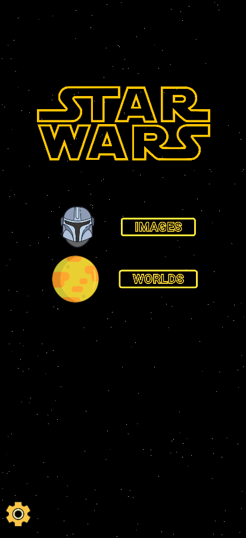
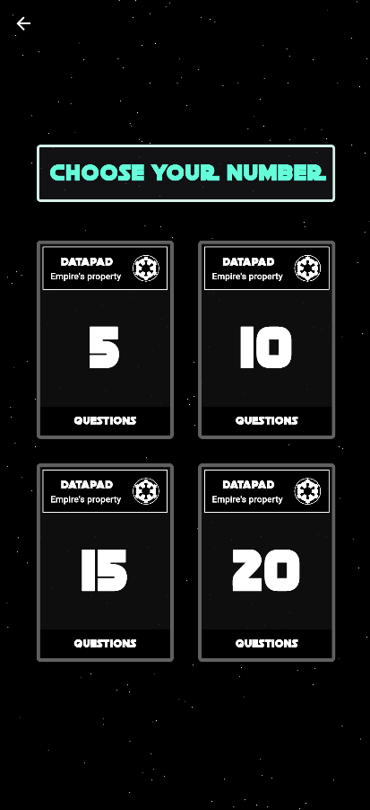
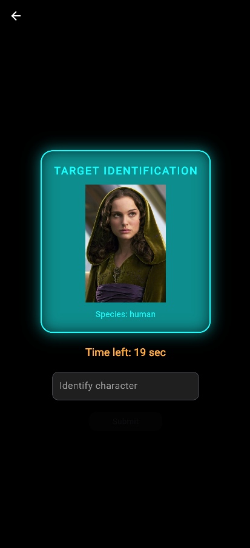
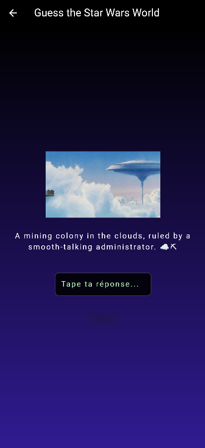

# 🌌 Star Wars Quiz Game

Welcome to **Star Wars Quiz Game**, a mobile application built with Flutter where players test their knowledge of **Star Wars worlds**.

---

## 🚀 Main Features

- 🪐 The user selects the number of questions: **5**, **10**, **15**, or **20**
- ❓ One question is asked at a time about a Star Wars world
- 🧠 The user types an answer and submits it
- ✅ The correct answer is displayed **after submission**
- 📊 At the end of the game, a **summary score** is shown

---

## 🛠️ Setting Up Flutter with Visual Studio Code

### 1. Prerequisites

- [Flutter SDK](https://flutter.dev/docs/get-started/install)
- [Visual Studio Code](https://code.visualstudio.com/)
- Android Studio or an iOS/Android simulator

### 2. Installing Flutter

```bash
# Clone Flutter
git clone https://github.com/flutter/flutter.git

# Add Flutter to your PATH
export PATH="$PATH:`pwd`/flutter/bin"

# Check setup
flutter doctor
```

### 3. Required VS Code Extensions

In VS Code, make sure to install these extensions:

- **Flutter**
- **Dart**

### 4. Running the App

```bash
cd star_wars_quiz_game
flutter pub get
flutter run
```

---

## 🖼️ 5. App Preview

<p align="center">
  
  <br><em>Image 1: Home screen</em><br><br>
  
  <br><em>Image 2: Question choices screen</em><br><br>
  
  <br><em>Image 3: Image mode screen</em><br><br>
  
  <br><em>Image 4: World mode screen</em>
</p>

---

## 📁 6. Project Structure

```
lib/
├── choices/
│   ├── ...
├── home/
│   ├── ...
├── quizzes/
│   ├── ...
├── audio_controller.dart
├── main.dart
├── settings.dart
├── stars.dart
├── starwars_logo.dart
```

---

## 🖋️ 7. Fonts

Star Wars font used in the app:

- [https://www.fontspace.com/category/star-wars](https://www.fontspace.com/category/star-wars)

---

## 🔊 8. Sounds

**Main theme** downloaded from:

- [https://soundfxcenter.com/download-sound/star-wars-main-theme-song/](https://soundfxcenter.com/download-sound/star-wars-main-theme-song/)

**Transition sounds** downloaded from:

- [https://www.sounds-resource.com/pc_computer/starwarsbattlefront/sound/9658/](https://www.sounds-resource.com/pc_computer/starwarsbattlefront/sound/9658/)

---

## 📚 9. Resources and Help

Some useful resources if this is your first Flutter project:

- [Lab: Write your first Flutter app](https://docs.flutter.dev/get-started/codelab)
- [Cookbook: Useful Flutter samples](https://docs.flutter.dev/cookbook)

Need help? Visit the [Flutter documentation](https://docs.flutter.dev/) for tutorials, guides, samples, and a complete API reference.

---
